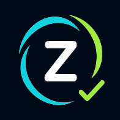

<div align="center">



# Zadiag

### Care routines, shared with confidence.

Zadiag helps families coordinate recurring care routines without turning daily
follow-up into daily friction.

[**Open Zadiag →**](https://www.zadiag.com)

[](https://github.com/m-idriss/zadiag/actions/workflows/ci.yml)
[](https://www.zadiag.com)
[](https://www.zadiag.com)
[](LICENSE)

</div>

## One simple loop

| Plan | Remind | Confirm | Review |
|:---:|:---:|:---:|:---:|
| Create the routine | Notify at the right moment | Send lightweight proof | Keep shared visibility |

The responsible adult gets reassurance. The participant gets a clear next
action. Everyone keeps the same history.

## Designed for real family life

- **Fast to start** — an installable iPhone-first experience, without an App
  Store download.
- **Calm by design** — focused role-based screens instead of a complex health
  dashboard.
- **Private by default** — scoped access, short-lived linking, cleanup paths,
  and local-only demo data.
- **Ready to learn** — bilingual flows and a production backend path built for
  measurable pilot iteration.

## Pilot-ready foundation

Zadiag already covers the complete product loop: family linking, routine
scheduling, push reminders, guided confirmation, responsible review, and shared
history.

The product is currently working pilot software. It is not a certified medical
device and does not diagnose, prescribe, or replace professional care.

[**Try the live experience**](https://www.zadiag.com) ·
[Product brief](docs/product-brief.md) ·
[Security](SECURITY.md)

## Quick start

```sh
corepack pnpm install
corepack pnpm dev
```

Open the local URL and start exploring. No Firebase configuration is required:
Zadiag automatically runs in private demo mode.

<details>
<summary><strong>Developer details</strong></summary>

Requirements: Node.js 22+, pnpm 11.7+, and Java 21 for the complete validation
suite.

### Verify before delivery

```sh
corepack pnpm check
corepack pnpm check:full
```

`check:full` also runs Firestore rules tests and requires Java 21. Production
configuration is documented in [.env.example](.env.example) and the
[deployment workflow](docs/deployment-workflow.md).

### Stack

React · TypeScript · Vite · Firebase · Workbox · Vitest

[Architecture](docs/caregiver-participant-architecture.md) ·
[Routine system](docs/create-routine.md) ·
[Pilot rollout](docs/routine-rollout.md)

</details>

---

Built by [Idriss](https://github.com/m-idriss) · MIT licensed
